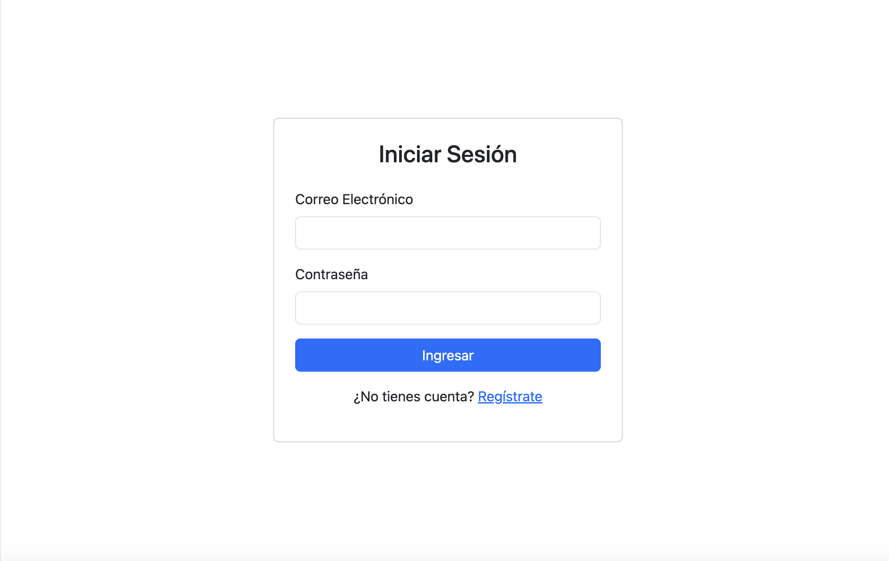
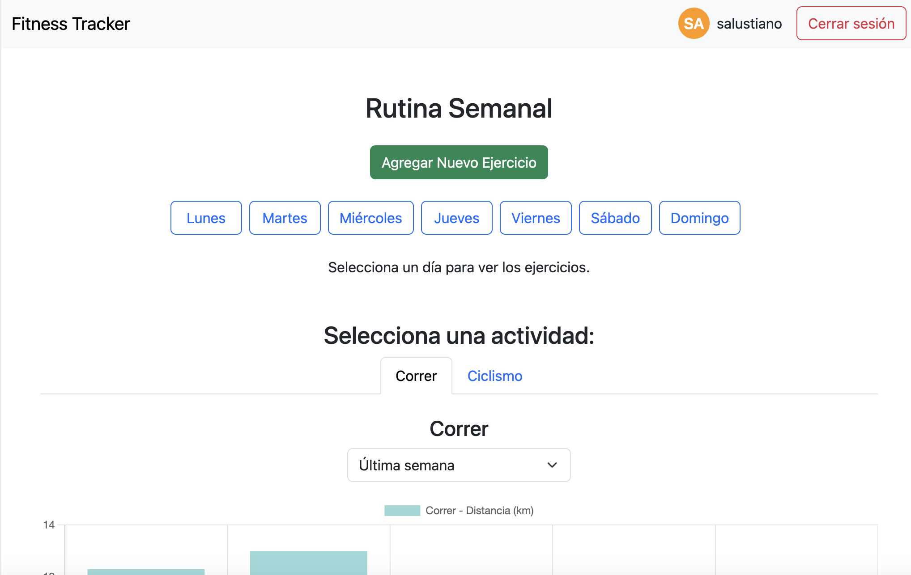
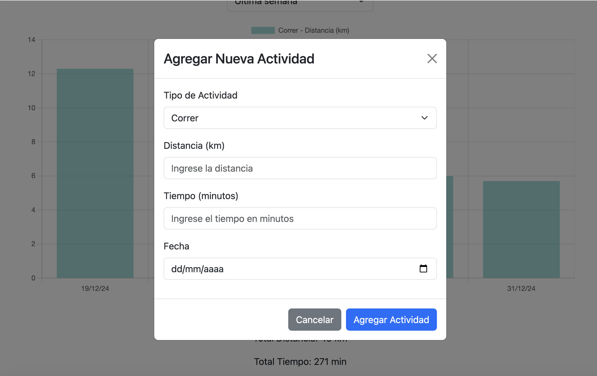
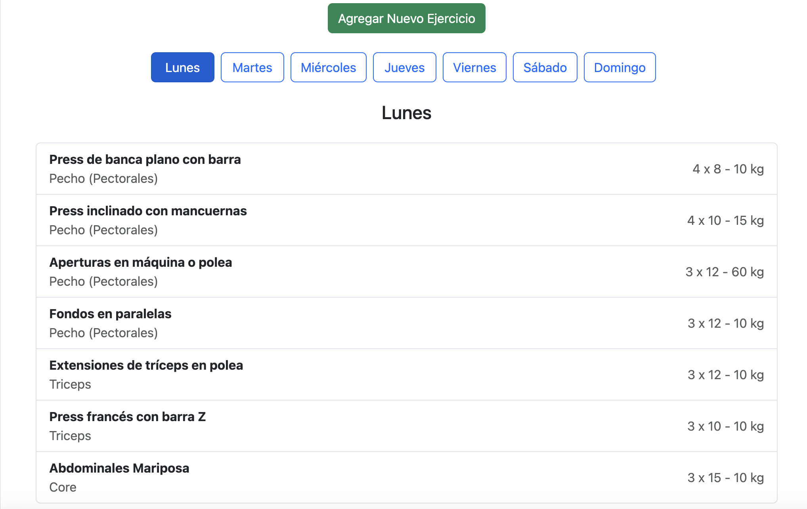
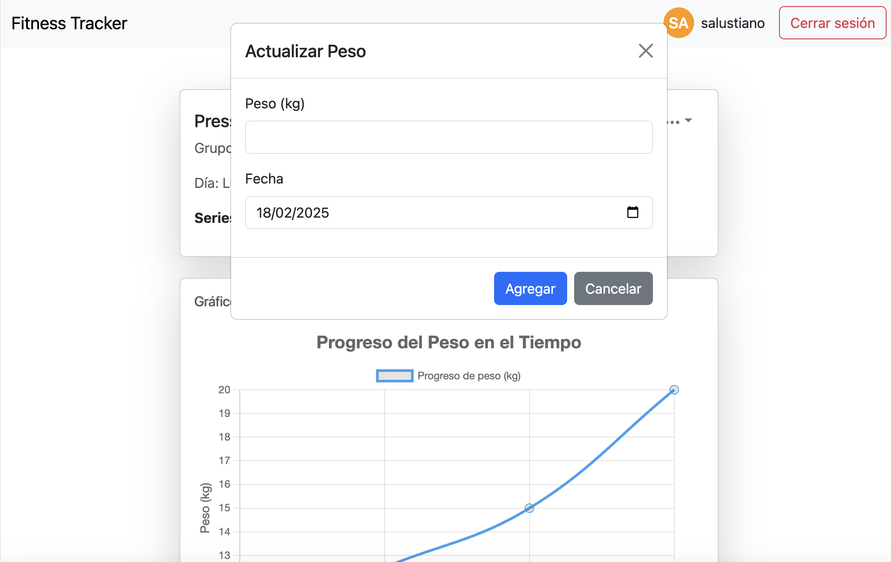

# **FitnessTrack 🏅**  

**FitnessTrack** es una aplicación diseñada para ayudarte a gestionar tu rutina de ejercicios, hacer un seguimiento de tus progresos y mantenerte motivado.  

📌 **Características principales:**  
✔ Agrega y personaliza tu rutina de ejercicios.  
✔ Registra el peso levantado y visualiza tu progreso en gráficos.  
✔ Realiza un seguimiento de actividades como correr o andar en bicicleta.  
✔ Interfaz intuitiva y fácil de usar.  

---

## 🌍 **Despliegue en Producción**  
La aplicación está disponible en **Netlify** y puedes acceder desde aquí:  

🔗 [**FitnessTrack en Netlify**](https://fitnesstracksalu.netlify.app/)  

⚠ **Nota:** La primera solicitud puede tardar unos segundos en responder debido al plan gratuito de Netlify.  

⏳ **¡Gracias por tu paciencia!** 😊  

---

## 🌟 **Características y Funcionalidades**  

### 💪 **Gestión de Ejercicios**  
- Agrega ejercicios a tu rutina y actualiza los pesos levantados.  
- Modifica y organiza tus rutinas fácilmente.  
- Visualización del progreso a través de gráficos interactivos.  

### 🏃 **Seguimiento de Actividades**  
- Registra actividades como correr o andar en bicicleta.  
- Ingresa la distancia recorrida y el tiempo empleado.  

### 📊 **Visualización del Progreso**  
- Estadísticas detalladas con gráficos para evaluar tu rendimiento.  
- Comparación de pesos levantados a lo largo del tiempo.  

---

## 🎨 **Capturas de Pantalla**  

### 🔒 **Inicio de Sesión**  
  

### 🏠 **Pantalla Principal**  
  

### 📊 **Seguimiento de Actividades**  
  

### 🏋️ **Rutina de Ejercicios**  
  

### 📊 **Gráficos de Progreso**  
  

---

## 🛠️ **Tecnologías Utilizadas**  

| Tecnología  | Descripción  |
|------------|-------------|
| **Frontend** | React, Bootstrap, React-Bootstrap, React-Router-Dom, Chart.js, React-Chartjs-2 |
| **Backend**  | Node.js, Express.js |
| **Autenticación**  | JSON Web Tokens (JWT) |
| **Gráficos**  | Chart.js |

🔗 Repositorio del backend: [**FitnessTrack-Back**](https://github.com/Salustiano-RoblesTeran/fitnessTrack-back)  

---

## 🚀 **Instalación y Ejecución**  

### 🛠️ **Requisitos previos**  
Antes de comenzar, asegúrate de tener instalado:  
- **Node.js**  
- **NPM** (Node Package Manager)  

### 🏢 **Instalación**  

#### **Frontend**  
```bash
git clone https://github.com/Salustiano-RoblesTeran/fitnessTrack-frontend.git
cd fitnessTrack-frontend
npm install
npm run dev
```

#### **Backend**  
```bash
git clone https://github.com/Salustiano-RoblesTeran/fitnessTrack-back.git
cd fitnessTrack-back
npm install
npm run server
```

---

## 📒 **Comandos  Ú tiles**  

| Comando  | Descripción  |
|----------|-------------|
| `npm run build`  | Construye la aplicación para producción. |
| `npm run preview` | Previsualiza la aplicación en producción. |
| `npm run lint` | Ejecuta **ESLint** para asegurar la calidad del código. |

---

## 🛠️ **Contribuciones**  
Si deseas contribuir al proyecto, puedes:  
✅ Abrir un **issue** para reportar problemas o sugerencias.  
✅ Enviar un **pull request** con mejoras o nuevas funcionalidades.  

---

## 📩 **Contacto**  

👨‍💻 **Desarrollador:** Salustiano Robles Terán  
📧 **Email:** saluroblesteran@gmail.com  
🌐 **Web:** [saluroblesteran.com](https://saluroblesteran.com)  

📌 **¡Gracias por tu interés en FitnessTrack!**  
💪 **Sigue entrenando y mejora tu rendimiento.** 💪  
